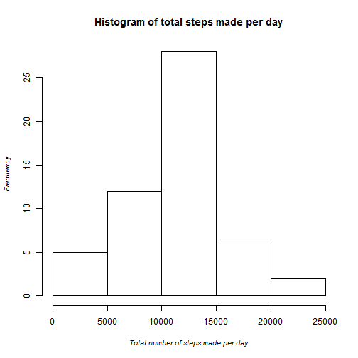
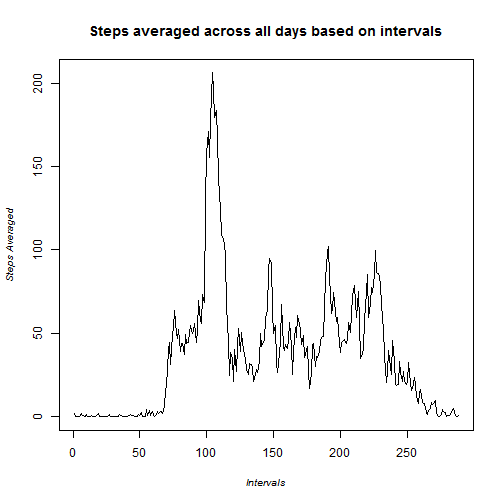
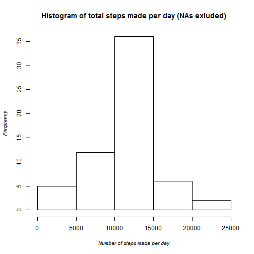
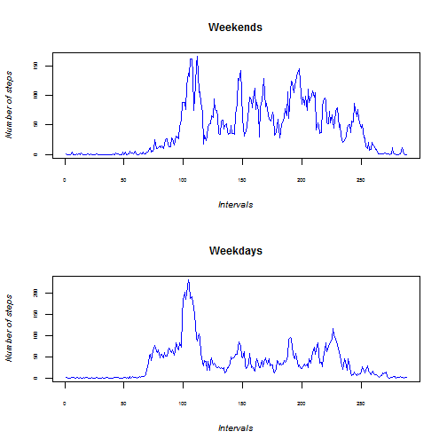
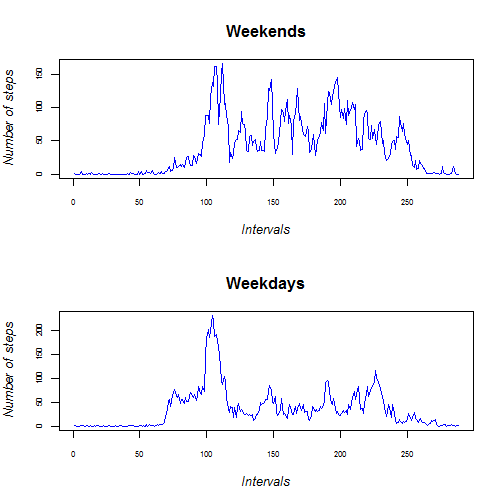

"PA1_template.Rmd1"
===============================

###1. Loading and Pre-preparing data

Following code loads the data :


```r
setwd("D:/RWorking Directory/RepData_PeerAssessment1")
data <- read.csv("activity.csv")
```

And transforms it into a suitable format:

```r
steps_sum <- tapply(data$steps, data$date, sum)
steps_sum <- as.data.frame(steps_sum)
steps_sum$steps_sum <- as.numeric(steps_sum$steps_sum)
```

###2. What is mean total number of steps taken per day?

Following chunk of code creates a histogram of total numbers of steps taken per day:


```r
hist(steps_sum$steps_sum, xlab = "Total number of steps made per day", main= "Histogram of total steps made per day", cex.main = 1.2, cex.lab=0.8, font.lab = 3)
```

 

Following chunk of code counts the mean and median of the sum of steps taken each day, i.e: median of sum of steps taken on day 1, day 2... etc. and similarly with mean. NA values were ignored.


```r
mean(steps_sum$steps_sum, na.rm=TRUE)
```

```
## [1] 10766
```

```r
median(steps_sum$steps_sum, na.rm=TRUE)
```

```
## [1] 10765
```

###3. What is the average daily activity pattern?

Creating a time series plot of the 5-minute interval (x-axis) and the average number of steps taken, averaged across all days (y-axis):


```r
steps_averaged <- tapply(data$steps, data$interval, mean, na.rm=TRUE)
steps_averaged <- as.data.frame(steps_averaged)
steps_averaged$steps_averaged <- as.numeric(steps_averaged$steps_averaged)

plot(steps_averaged$steps_averaged, type="l", main="Steps averaged across all days based on intervals", xlab="Intervals", ylab="Steps Averaged", cex.main = 1.2, cex.lab=0.8, font.lab = 3)
```

 

Finding interval corresponding to the highest steps average:


```r
steps_averaged$interval <- rownames(steps_averaged)
steps_averaged[which.max(steps_averaged$steps_averaged),]
```

```
##     steps_averaged interval
## 835          206.2      835
```

###4. Imputing missing values

How many missing values are there in the data set (number of rows)

```r
nrow(data[!complete.cases(data),])
```

```
## [1] 2304
```

Exchanging missing values and creating a new data set with the missing values excganged:


```r
nd <- merge(data, steps_averaged, by="interval")
nd <- nd[order(nd$date),]

nd$steps[is.na(nd$steps)] <- nd$steps_averaged[is.na(nd$steps)]
```

Creating a histogram of the total number of steps taken per day:


```r
steps_sum2 <- tapply(nd$steps, nd$date, sum)
steps_sum2 <- as.data.frame(steps_sum2)
steps_sum2$steps_sum2 <- as.numeric(steps_sum2$steps_sum2)

hist(steps_sum2$steps_sum2, xlab = "Number of steps made per day", main= "Histogram of total steps made per day (NAs exluded)", cex.main = 1.2, cex.lab=0.8, font.lab=3)
```

 

Comparing two outcomes: with NAs and w/o NAs based on mean and median


```r
mean_na <- mean(steps_sum$steps_sum, na.rm=TRUE)
median_na <- median(steps_sum$steps_sum, na.rm=TRUE)
mean_nar <- mean(steps_sum2$steps_sum2, na.rm=TRUE)
median_nar <- median(steps_sum2$steps_sum2, na.rm=TRUE)
comp_table <- matrix(c(mean_na, median_na, mean_nar, median_nar), ncol=2)
rownames(comp_table) <- c("Mean", "Median")
colnames(comp_table) <- c("With NAs", "W/o NAs")
comp_table
```

```
##        With NAs W/o NAs
## Mean      10766   10766
## Median    10765   10766
```

###5. Are there differences in activity patterns between weekdays and weekends?

Create a new factor variable with two level information on the dates weekday or weekend:


```r
Sys.setlocale("LC_TIME", "English")
```

```
## [1] "English_United States.1252"
```

```r
nd$day <- as.Date(nd$date)
nd$day <- weekdays(nd$day, abbreviate=FALSE)

nd$day[nd$day %in% c("Saturday", "Sunday")] <- "weekend"
nd$day[nd$day %in% c("Monday", "Tuesday", "Wednesday", "Thursday", "Friday")] <- "weekday"
```


```r
weekdays <- nd[nd$day=="weekday",] 
weekends <- nd[nd$day=="weekend",]
wd <- as.data.frame(tapply(weekdays$steps, weekdays$interval, mean, na.rm=TRUE))
we <- as.data.frame(tapply(weekends$steps, weekends$interval, mean, na.rm=TRUE))

wd$intervals <- rownames(wd)
we$intervals <- rownames(we)

colnames(wd) <- c("steps", "intervals")
colnames(we) <- c("steps", "intervals")

par(mfrow=c(2,1))

plot(we$steps, type="l", main = "Weekends", cex.lab=0.8, cex.axis=0.5, font.lab=3, cex.main=1, xlab="Intervals", ylab="Number of steps", col="blue")
plot(wd$steps, type="l", main = "Weekdays", cex.lab=0.8, cex.axis=0.5, font.lab=3, cex.main=1, xlab="Intervals", ylab="Number of steps", col="blue")
```

 

Creating a html file based on the above:

```
## 
## 
## processing file: PA1_template.Rmd
```

```
## 
  |                                                                       
  |                                                                 |   0%
  |                                                                       
  |..                                                               |   4%
##   ordinary text without R code
## 
## 
  |                                                                       
  |.....                                                            |   7%
## label: unnamed-chunk-14 (with options) 
## List of 1
##  $ echo: logi TRUE
## 
## 
  |                                                                       
  |.......                                                          |  11%
##   ordinary text without R code
## 
## 
  |                                                                       
  |..........                                                       |  15%
## label: unnamed-chunk-15 (with options) 
## List of 1
##  $ echo: logi TRUE
## 
## 
  |                                                                       
  |............                                                     |  19%
##   ordinary text without R code
## 
## 
  |                                                                       
  |..............                                                   |  22%
## label: unnamed-chunk-16 (with options) 
## List of 1
##  $ echo: logi TRUE
```

```
## 
  |                                                                       
  |.................                                                |  26%
##   ordinary text without R code
## 
## 
  |                                                                       
  |...................                                              |  30%
## label: unnamed-chunk-17 (with options) 
## List of 1
##  $ echo: logi TRUE
## 
## 
  |                                                                       
  |......................                                           |  33%
##   ordinary text without R code
## 
## 
  |                                                                       
  |........................                                         |  37%
## label: unnamed-chunk-18 (with options) 
## List of 1
##  $ echo: logi TRUE
```

```
## 
  |                                                                       
  |..........................                                       |  41%
##   ordinary text without R code
## 
## 
  |                                                                       
  |.............................                                    |  44%
## label: unnamed-chunk-19 (with options) 
## List of 1
##  $ echo: logi TRUE
## 
## 
  |                                                                       
  |...............................                                  |  48%
##   ordinary text without R code
## 
## 
  |                                                                       
  |..................................                               |  52%
## label: unnamed-chunk-20 (with options) 
## List of 1
##  $ echo: logi TRUE
## 
## 
  |                                                                       
  |....................................                             |  56%
##   ordinary text without R code
## 
## 
  |                                                                       
  |.......................................                          |  59%
## label: unnamed-chunk-21
## 
  |                                                                       
  |.........................................                        |  63%
##   ordinary text without R code
## 
## 
  |                                                                       
  |...........................................                      |  67%
## label: unnamed-chunk-22
```

```
## 
  |                                                                       
  |..............................................                   |  70%
##   ordinary text without R code
## 
## 
  |                                                                       
  |................................................                 |  74%
## label: unnamed-chunk-23
## 
  |                                                                       
  |...................................................              |  78%
##   ordinary text without R code
## 
## 
  |                                                                       
  |.....................................................            |  81%
## label: unnamed-chunk-24
## 
  |                                                                       
  |.......................................................          |  85%
##   ordinary text without R code
## 
## 
  |                                                                       
  |..........................................................       |  89%
## label: unnamed-chunk-25
```

```
## 
  |                                                                       
  |............................................................     |  93%
##   ordinary text without R code
## 
## 
  |                                                                       
  |...............................................................  |  96%
## label: unnamed-chunk-26 (with options) 
## List of 1
##  $ echo: logi FALSE
```

```
## 
  |                                                                       
  |.................................................................| 100%
##   ordinary text without R code
```

```
## output file: PA1_template.md
```

 

